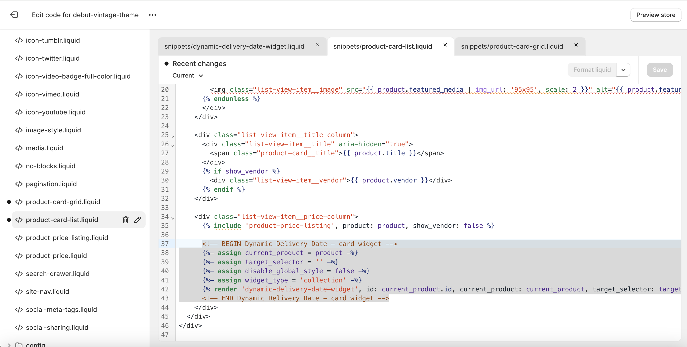

# Install on product card

Install on your store theme by inserting code snippet.

:::caution

This guide might not be consistent with your theme. Contact support at [edgeless.apps@gmail.com](mailto:edgeless.apps@gmail.com) for installation help.

:::

## App embed

In your theme editor, enable the app embed. This adds Javascript to your theme that powers your widgets.


## Code snippet

In your code editor, create new snippet named <code>dynamic-delivery-date-widget</code>. Copy and paste the following

<!-- prettier-ignore -->
```html

  Renders a Dynamic Delivery Date widget component

  Accepts:
  - id: {String} ID for the widget. Generally, app block id is used here. Default: empty (optional)
  - current_product: {Object} Product Liquid object.
  - default_variant_id: {String} Default variant ID to apply to widget. Generally, used on cart page to show widget for a line item. Default: empty (optional)
    - Widget uses product.selected_or_first_available_variant if not provided.
  - target_selector: {String} Target CSS selector to watch variant selection changes - usually the variant id form input Default: empty (optional)
  - disable_global_style: {Boolean} Render widget with CSS encapsulation. Default: false (optional)
  - widget_type: {String} Dynamic "widget.type" value to pass to widget liquid template to customize template for different environments. Default: 'product' (optional)
  - widget_payload: {String} Dynamic "widget.payload" json payload value to pass to widget liquid template to customize template for any custom use case. Default: 'null' (optional)

  Usage:
  
  
  
  
  
  
  {
    "shop": {{ shop | json }}
  }
  
  

<dynamic-delivery-date-widget
  data-id="{{id | default: ''}}"
  data-target="{{target_selector | default: '' | escape}}"
  data-type="{{widget_type | default: 'product'}}"
  data-disable-global-style
  role="status"
>
  <script data-id="widget_context" type="application/json">
  {
    "product": {{current_product | json}},
    
    "selected_variant_id": {{ selected_variant_id | default: "null" }},
    
    "product_collection_ids": {{product_collection_ids | json}}
  }
  </script>
  <template data-id="widget_payload" data-type="application/json">
  {{widget_payload | default: 'null' | escape}}
  </template>
</dynamic-delivery-date-widget>
```

## Render code snippet on collection page

### Online store 2.0

In your code editor, go to snippets and open the <code>card-product</code> snippet.

Under product price, copy and paste the following

<!-- prettier-ignore -->
```html
<!-- BEGIN Dynamic Delivery Date - card widget -->





<!-- END Dynamic Delivery Date - card widget -->
```

For paste location reference:

<code>card-product</code>


### Vintage

In your code editor, go to snippets and open the <code>product-card-grid</code> and <code>product-card-list</code> snippets.

Under product price, copy and paste the following

<!-- prettier-ignore -->
```html
<!-- BEGIN Dynamic Delivery Date - card widget -->





<!-- END Dynamic Delivery Date - card widget -->
```

For paste location reference:

<code>product-card-grid</code>


<code>product-card-list</code>


## Shopify references

- [Customizing vintage themes](https://help.shopify.com/en/manual/online-store/themes/themes-by-shopify/vintage-themes/customizing-vintage-themes)
- [Theme architecture versions](https://help.shopify.com/en/manual/online-store/themes/managing-themes/versions)
- [Extend your theme with apps](https://help.shopify.com/en/manual/online-store/themes/theme-structure/extend/apps#app-embeds)
- [Snippets](https://shopify.dev/docs/storefronts/themes/architecture#snippets)
- [Render liquid tag](https://shopify.dev/docs/api/liquid/tags/render)
