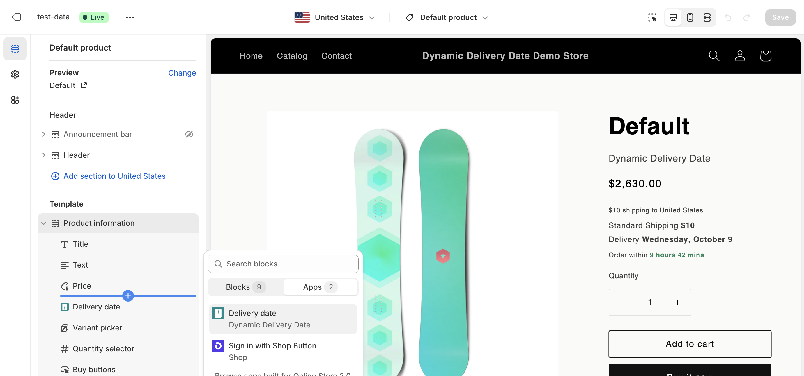

# Online store 2.0

Install on your sections compatible store theme through app blocks.

## App embed

In your theme editor, enable the app embed. This adds Javascript to your theme that powers your widgets.

## App block

In your theme editor, add the app block to a section in the product page. We recommend to add it under the product price block.

:::tip

For advanced widget placement and setup, check out the advanced guide or contact support at [edgeless.apps@gmail.com](mailto:edgeless.apps@gmail.com)

:::

## Shopify references

- [Customizing themes](https://help.shopify.com/en/manual/online-store/themes/customizing-themes)
- [Theme architecture versions](https://help.shopify.com/en/manual/online-store/themes/managing-themes/versions)
- [Extend your theme with apps](https://help.shopify.com/en/manual/online-store/themes/theme-structure/extend/apps)